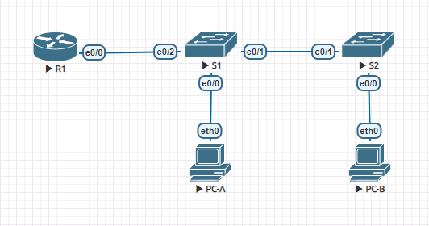

# VLAN и маршрутизация между VLAN
## Задание:
1. Создать сеть и настроить основные параметры устройств
2. Создать сети VLAN и назначить порты коммутаторов
3. Настроить транк 802.1Q между коммутаторами
4. Настроить маршрутизацию между сетями VLAN
5. Проверить, что маршрутизация между VLAN работает

## Топология
  

## Таблица адресации

|  			Device 		 |  			Interface 		 |   			IP Address 		  |   			Subnet Mask 		  |  			Default Gateway 		 |
|:--------:|:-----------:|:--------------:|:---------------:|:-----------------:|
|  			R1 		     | Et0/0.3     |  			192.168.3.1 		  |  			255.255.255.0 		 |  			N/A 		             |
|          | Et0/0.4     |  			192.168.4.1 		  |  			255.255.255.0 		 |                   |
|          | Et0/0.8     |  			N/A 		          |  			N/A 		           |                   |
|  			S1 		     |  			VLAN 3 		    |  			192.168.3.11 		 |  			255.255.255.0 		 |  			192.168.3.1 		     |
|  			S2 		     |  			VLAN 3 		    |  			192.168.3.12 		 |  			255.255.255.0 		 |  			192.168.3.1 		     |
|  			PC-A 		   |  			NIC 		       |  			192.168.3.3 		  |  			255.255.255.0 		 |  			192.168.3.1 		     |
|  			PC-B 		   |  			NIC 		       |  			192.168.4.3 		  |  			255.255.255.0 		 |  			192.168.4.1 		     |

## Таблица VLAN
|  			VLAN 		 |     			Name 		    |            			Interface Assigned 		          |
|:------:|:------------:|:---------------------------------------:|
|  			3 		    |  			Management 		 |  			S1: VLAN 3  			  			S2: VLAN 3  			 S1: Et0/0  		 |
|  			4 		    |  			Operations 		 |  			S2: Et0/0 		                             |
|  			7 		    |  			ParkingLot 		 |  			S1: Et0/3 			  			 S2: Et0/2-3  			 		            |
|  			8 		    |  			Native 		     |  			N/A 		                                   |

## Решение:
1. [Создание сети и настройка основных параметров устройства](https://github.com/GAFisher/test/blob/main/README.md#1-%D1%81%D0%BE%D0%B7%D0%B4%D0%B0%D0%BD%D0%B8%D0%B5-%D1%81%D0%B5%D1%82%D0%B8-%D0%B8-%D0%BD%D0%B0%D1%81%D1%82%D1%80%D0%BE%D0%B9%D0%BA%D0%B0-%D0%BE%D1%81%D0%BD%D0%BE%D0%B2%D0%BD%D1%8B%D1%85-%D0%BF%D0%B0%D1%80%D0%B0%D0%BC%D0%B5%D1%82%D1%80%D0%BE%D0%B2-%D1%83%D1%81%D1%82%D1%80%D0%BE%D0%B9%D1%81%D1%82%D0%B2%D0%B0)
    + [Произведем базовую настройку маршрутизатора](https://github.com/GAFisher/test/blob/main/README.md#%D0%BF%D1%80%D0%BE%D0%B8%D0%B7%D0%B2%D0%B5%D0%B4%D0%B5%D0%BC-%D0%B1%D0%B0%D0%B7%D0%BE%D0%B2%D1%83%D1%8E-%D0%BD%D0%B0%D1%81%D1%82%D1%80%D0%BE%D0%B9%D0%BA%D1%83-%D0%BC%D0%B0%D1%80%D1%88%D1%80%D1%83%D1%82%D0%B8%D0%B7%D0%B0%D1%82%D0%BE%D1%80%D0%B0)
    + [Произведем базовую настройку коммутаторов](https://github.com/GAFisher/test/blob/main/README.md#%D0%BF%D1%80%D0%BE%D0%B8%D0%B7%D0%B2%D0%B5%D0%B4%D0%B5%D0%BC-%D0%B1%D0%B0%D0%B7%D0%BE%D0%B2%D1%83%D1%8E-%D0%BD%D0%B0%D1%81%D1%82%D1%80%D0%BE%D0%B9%D0%BA%D1%83-%D0%BA%D0%BE%D0%BC%D0%BC%D1%83%D1%82%D0%B0%D1%82%D0%BE%D1%80%D0%BE%D0%B2)
    + [Настроим ПК](https://github.com/GAFisher/test/blob/main/README.md#%D0%BD%D0%B0%D1%81%D1%82%D1%80%D0%BE%D0%B8%D0%BC-%D0%BF%D0%BA)
2. [Создание сетей VLAN и назначение портов коммутатора](https://github.com/GAFisher/test/blob/main/README.md#2-%D1%81%D0%BE%D0%B7%D0%B4%D0%B0%D0%BD%D0%B8%D0%B5-%D1%81%D0%B5%D1%82%D0%B5%D0%B9-vlan-%D0%B8-%D0%BD%D0%B0%D0%B7%D0%BD%D0%B0%D1%87%D0%B5%D0%BD%D0%B8%D0%B5-%D0%BF%D0%BE%D1%80%D1%82%D0%BE%D0%B2-%D0%BA%D0%BE%D0%BC%D0%BC%D1%83%D1%82%D0%B0%D1%82%D0%BE%D1%80%D0%B0)
    + [Создадим сети VLAN на коммутаторах](https://github.com/GAFisher/test/blob/main/README.md#%D1%81%D0%BE%D0%B7%D0%B4%D0%B0%D0%B4%D0%B8%D0%BC-%D1%81%D0%B5%D1%82%D0%B8-vlan-%D0%BD%D0%B0-%D0%BA%D0%BE%D0%BC%D0%BC%D1%83%D1%82%D0%B0%D1%82%D0%BE%D1%80%D0%B0%D1%85)
    + [Настроим интерфейс управления и шлюз по умолчанию на каждом коммутаторе, используя информацию об IP-адресе в таблице адресации](https://github.com/GAFisher/test/blob/main/README.md#%D0%BD%D0%B0%D1%81%D1%82%D1%80%D0%BE%D0%B8%D0%BC-%D0%B8%D0%BD%D1%82%D0%B5%D1%80%D1%84%D0%B5%D0%B9%D1%81-%D1%83%D0%BF%D1%80%D0%B0%D0%B2%D0%BB%D0%B5%D0%BD%D0%B8%D1%8F-%D0%B8-%D1%88%D0%BB%D1%8E%D0%B7-%D0%BF%D0%BE-%D1%83%D0%BC%D0%BE%D0%BB%D1%87%D0%B0%D0%BD%D0%B8%D1%8E-%D0%BD%D0%B0-%D0%BA%D0%B0%D0%B6%D0%B4%D0%BE%D0%BC-%D0%BA%D0%BE%D0%BC%D0%BC%D1%83%D1%82%D0%B0%D1%82%D0%BE%D1%80%D0%B5-%D0%B8%D1%81%D0%BF%D0%BE%D0%BB%D1%8C%D0%B7%D1%83%D1%8F-%D0%B8%D0%BD%D1%84%D0%BE%D1%80%D0%BC%D0%B0%D1%86%D0%B8%D1%8E-%D0%BE%D0%B1-ip-%D0%B0%D0%B4%D1%80%D0%B5%D1%81%D0%B5-%D0%B2-%D1%82%D0%B0%D0%B1%D0%BB%D0%B8%D1%86%D0%B5-%D0%B0%D0%B4%D1%80%D0%B5%D1%81%D0%B0%D1%86%D0%B8%D0%B8)
    + [Назначим все неиспользуемые порты коммутаторов во vlan Parking_Lot, настроим их в режиме access и административно деактивируем](https://github.com/GAFisher/test/blob/main/README.md#%D0%BD%D0%B0%D0%B7%D0%BD%D0%B0%D1%87%D0%B8%D0%BC-%D0%B2%D1%81%D0%B5-%D0%BD%D0%B5%D0%B8%D1%81%D0%BF%D0%BE%D0%BB%D1%8C%D0%B7%D1%83%D0%B5%D0%BC%D1%8B%D0%B5-%D0%BF%D0%BE%D1%80%D1%82%D1%8B-%D0%BA%D0%BE%D0%BC%D0%BC%D1%83%D1%82%D0%B0%D1%82%D0%BE%D1%80%D0%BE%D0%B2-%D0%B2%D0%BE-vlan-parking_lot-%D0%BD%D0%B0%D1%81%D1%82%D1%80%D0%BE%D0%B8%D0%BC-%D0%B8%D1%85-%D0%B2-%D1%80%D0%B5%D0%B6%D0%B8%D0%BC%D0%B5-access-%D0%B8-%D0%B0%D0%B4%D0%BC%D0%B8%D0%BD%D0%B8%D1%81%D1%82%D1%80%D0%B0%D1%82%D0%B8%D0%B2%D0%BD%D0%BE-%D0%B4%D0%B5%D0%B0%D0%BA%D1%82%D0%B8%D0%B2%D0%B8%D1%80%D1%83%D0%B5%D0%BC)
    + [Назначим сети VLAN соответствующим интерфейсам коммутатора и убедимся, что VLAN назначены на правильные интерфейсы с помощью команды show vlan brief](https://github.com/GAFisher/test/blob/main/README.md#%D0%BD%D0%B0%D0%B7%D0%BD%D0%B0%D1%87%D0%B8%D0%BC-%D1%81%D0%B5%D1%82%D0%B8-vlan-%D1%81%D0%BE%D0%BE%D1%82%D0%B2%D0%B5%D1%82%D1%81%D1%82%D0%B2%D1%83%D1%8E%D1%89%D0%B8%D0%BC-%D0%B8%D0%BD%D1%82%D0%B5%D1%80%D1%84%D0%B5%D0%B9%D1%81%D0%B0%D0%BC-%D0%BA%D0%BE%D0%BC%D0%BC%D1%83%D1%82%D0%B0%D1%82%D0%BE%D1%80%D0%B0-%D0%B8-%D1%83%D0%B1%D0%B5%D0%B4%D0%B8%D0%BC%D1%81%D1%8F-%D1%87%D1%82%D0%BE-vlan-%D0%BD%D0%B0%D0%B7%D0%BD%D0%B0%D1%87%D0%B5%D0%BD%D1%8B-%D0%BD%D0%B0-%D0%BF%D1%80%D0%B0%D0%B2%D0%B8%D0%BB%D1%8C%D0%BD%D1%8B%D0%B5-%D0%B8%D0%BD%D1%82%D0%B5%D1%80%D1%84%D0%B5%D0%B9%D1%81%D1%8B-%D1%81-%D0%BF%D0%BE%D0%BC%D0%BE%D1%89%D1%8C%D1%8E-%D0%BA%D0%BE%D0%BC%D0%B0%D0%BD%D0%B4%D1%8B-show-vlan-brief)
3. [Произведем конфигурацию магистрального канала стандарта 802.1Q между коммутаторами](https://github.com/GAFisher/test/blob/main/README.md#3-%D0%BF%D1%80%D0%BE%D0%B8%D0%B7%D0%B2%D0%B5%D0%B4%D0%B5%D0%BC-%D0%BA%D0%BE%D0%BD%D1%84%D0%B8%D0%B3%D1%83%D1%80%D0%B0%D1%86%D0%B8%D1%8E-%D0%BC%D0%B0%D0%B3%D0%B8%D1%81%D1%82%D1%80%D0%B0%D0%BB%D1%8C%D0%BD%D0%BE%D0%B3%D0%BE-%D0%BA%D0%B0%D0%BD%D0%B0%D0%BB%D0%B0-%D1%81%D1%82%D0%B0%D0%BD%D0%B4%D0%B0%D1%80%D1%82%D0%B0-8021q-%D0%BC%D0%B5%D0%B6%D0%B4%D1%83-%D0%BA%D0%BE%D0%BC%D0%BC%D1%83%D1%82%D0%B0%D1%82%D0%BE%D1%80%D0%B0%D0%BC%D0%B8)
    + [Настроим магистральный интерфейс Et0/1 на коммутаторах S1 и S2](https://github.com/GAFisher/test/blob/main/README.md#%D0%BD%D0%B0%D1%81%D1%82%D1%80%D0%BE%D0%B8%D0%BC-%D0%BC%D0%B0%D0%B3%D0%B8%D1%81%D1%82%D1%80%D0%B0%D0%BB%D1%8C%D0%BD%D1%8B%D0%B9-%D0%B8%D0%BD%D1%82%D0%B5%D1%80%D1%84%D0%B5%D0%B9%D1%81-et01-%D0%BD%D0%B0-%D0%BA%D0%BE%D0%BC%D0%BC%D1%83%D1%82%D0%B0%D1%82%D0%BE%D1%80%D0%B0%D1%85-s1-%D0%B8-s2)
    + [Настроим магистральный интерфейс Et0/2 на коммутаторе S1](https://github.com/GAFisher/test/blob/main/README.md#%D0%BD%D0%B0%D1%81%D1%82%D1%80%D0%BE%D0%B8%D0%BC-%D0%BC%D0%B0%D0%B3%D0%B8%D1%81%D1%82%D1%80%D0%B0%D0%BB%D1%8C%D0%BD%D1%8B%D0%B9-%D0%B8%D0%BD%D1%82%D0%B5%D1%80%D1%84%D0%B5%D0%B9%D1%81-et02-%D0%BD%D0%B0-%D0%BA%D0%BE%D0%BC%D0%BC%D1%83%D1%82%D0%B0%D1%82%D0%BE%D1%80%D0%B5-s1)
4. [Произведем настройку маршрутизатора](https://github.com/GAFisher/test/blob/main/README.md#4-%D0%BF%D1%80%D0%BE%D0%B8%D0%B7%D0%B2%D0%B5%D0%B4%D0%B5%D0%BC-%D0%BD%D0%B0%D1%81%D1%82%D1%80%D0%BE%D0%B9%D0%BA%D1%83-%D0%BC%D0%B0%D1%80%D1%88%D1%80%D1%83%D1%82%D0%B8%D0%B7%D0%B0%D1%82%D0%BE%D1%80%D0%B0)
5. [Проверим, работает ли маршрутизация между VLAN](https://github.com/GAFisher/test/blob/main/README.md#5-%D0%BF%D1%80%D0%BE%D0%B2%D0%B5%D1%80%D0%B8%D0%BC-%D1%80%D0%B0%D0%B1%D0%BE%D1%82%D0%B0%D0%B5%D1%82-%D0%BB%D0%B8-%D0%BC%D0%B0%D1%80%D1%88%D1%80%D1%83%D1%82%D0%B8%D0%B7%D0%B0%D1%86%D0%B8%D1%8F-%D0%BC%D0%B5%D0%B6%D0%B4%D1%83-vlan)
    + [Выполним тесты с PC-A](https://github.com/GAFisher/test/blob/main/README.md#%D0%B2%D1%8B%D0%BF%D0%BE%D0%BB%D0%BD%D0%B8%D0%BC-%D1%82%D0%B5%D1%81%D1%82%D1%8B-%D1%81-pc-a)
    + [Выполним тест с PC-B](https://github.com/GAFisher/test/blob/main/README.md#%D0%B2%D1%8B%D0%BF%D0%BE%D0%BB%D0%BD%D0%B8%D0%BC-%D1%82%D0%B5%D1%81%D1%82-%D1%81-pc-b)

## 1. Создание сети и настройка основных параметров устройства
#### Произведем базовую настройку маршрутизатора:

```Router>enable
Router#configure terminal
Router(config)#hostname R1
R1(config)#no ip domain-lookup 
R1(config)#enable secret class
R1(config)#line console 0
R1(config-line)#password cisco
R1(config-line)#login 
R1(config-line)#exit
R1(config)#line vty 0 4
R1(config-line)#password cisco
R1(config-line)#login         
R1(config-line)#exit          
R1(config)#service password-encryption 
R1(config)#banner motd #Authorized Access Only!#
R1(config)#end
R1#copy running-config startup-config
Destination filename [startup-config]? 
Building configuration...
[OK]
R1#clock set 14:18:00 6 march 2021
R1#
```

#### Произведем базовую настройку коммутаторов:

```Switch>enable 
Switch#configure terminal 
Switch(config)#hostname S1
S1(config)#no ip domain-lookup 
S1(config)#enable secret class
S1(config)#line console 0
S1(config-line)#password cisco
S1(config-line)#login
S1(config-line)#exit
S1(config)#line vty 0 4
S1(config-line)#password cisco
S1(config-line)#login         
S1(config-line)#exit          
S1(config)#service password-encryption
S1(config)#banner motd #Authorized Access Only!#
S1(config)#end
S1#clock set 14:21:00 6 march 2021
S1#copy running-config startup-config
Destination filename [startup-config]? 
Building configuration...
Compressed configuration from 992 bytes to 724 bytes[OK]
S1#
```
```Switch>enable
Switch#configure terminal 
Switch(config)#hostname S2
S2(config)#no ip domain-lookup 
S2(config)#enable secret class
S2(config)#line console 0
S2(config-line)#password cisco
S2(config-line)#login
S2(config-line)#exit
S2(config)#line vty 0 4
S2(config-line)#password cisco
S2(config-line)#login
S2(config-line)#exit
S2(config)#service password-encryption
S2(config)#banner motd #Authorized Access Only!#
S2(config)#end
S2#clock set 14:23:00 6 march 2021
S2#copy running-config startup-config
Destination filename [startup-config]? 
Building configuration...
Compressed configuration from 992 bytes to 723 bytes[OK]
S2#
```
#### Настроим ПК:
```
VPCS> set pcname PC-A

PC-A> ip 192.168.3.3 255.255.255.0 192.168.3.1
Checking for duplicate address...
PC1 : 192.168.3.3 255.255.255.0 gateway 192.168.3.1

PC-A> save
Saving startup configuration to startup.vpc
.  done

PC-A> 
```

```
VPCS> set pcname PC-B

PC-B> ip 192.168.4.3 255.255.255.0 192.168.4.1
Checking for duplicate address...
PC1 : 192.168.4.3 255.255.255.0 gateway 192.168.4.1

PC-B> save
Saving startup configuration to startup.vpc
.  done

PC-B>
```
## 2. Создание сетей VLAN и назначение портов коммутатора
#### Создадим сети VLAN на коммутаторах:
```S1#configure terminal 
S1(config)#vlan 3
S1(config-vlan)#name Management
S1(config-vlan)#vlan 4
S1(config-vlan)#name Operations
S1(config-vlan)#vlan 7
S1(config-vlan)#name ParkingLot
S1(config-vlan)#vlan 8
S1(config-vlan)#name Native
S1(config-vlan)#exit
S1(config)#
```
```S2#configure terminal 
S2(config)#vlan 3
S2(config-vlan)#name Management
S2(config-vlan)#vlan 4
S2(config-vlan)#name Operations
S2(config-vlan)#vlan 7
S2(config-vlan)#name ParkingLot
S2(config-vlan)#vlan 8
S2(config-vlan)#name Native
S2(config-vlan)#exit
S2(config)#
```
#### Настроим интерфейс управления и шлюз по умолчанию на каждом коммутаторе, используя информацию об IP-адресе в таблице адресации:
```S1(config)#interface vlan 3
S1(config-if)#ip address 192.168.3.11 255.255.255.0
S1(config-if)#no shutdown 
S1(config-if)#exit
S1(config)#ip default-gateway 192.168.3.1
S1(config)#
```
```S2(config)#interface vlan 3
S2(config-if)#ip address 192.168.3.12 255.255.255.0
S2(config-if)#no shutdown 
S2(config-if)#exit
S2(config)#ip default-gateway 192.168.3.1
S2(config)#
```

#### Назначим все неиспользуемые порты коммутаторов во vlan Parking_Lot, настроим их в режиме access и административно деактивируем:

```S1(config)#interface Et0/3
S1(config-if)#switchport mode access 
S1(config-if)#switchport access vlan 7
S1(config-if)#shutdown 
S1(config-if)#exit
S1(config)#
```
```
S2(config)#interface range Et0/2-3
S2(config-if-range)#switchport mode access 
S2(config-if-range)#switchport access vlan 7
S2(config-if-range)#shutdown
S2(config-if-range)#exit
S2(config)#
```

#### Назначим сети VLAN соответствующим интерфейсам коммутатора и убедимся, что VLAN назначены на правильные интерфейсы с помощью команды show vlan brief:
```
S1(config)#interface Et0/0
S1(config-if)#switchport mode access 
S1(config-if)#switchport access vlan 3
S1(config)#end
S1#show vlan brief 

VLAN Name                             Status    Ports
---- -------------------------------- --------- -------------------------------
1    default                          active    Et0/2
3    Management                       active    Et0/0
4    Operations                       active    
7    ParkingLot                       active    Et0/3
8    Native                           active    
1002 fddi-default                     act/unsup 
1003 token-ring-default               act/unsup 
1004 fddinet-default                  act/unsup 
1005 trnet-default                    act/unsup 
S1#
```
```
S2(config)#interface Et0/0
S2(config-if)#switchport mode access
S2(config-if)#switchport access vlan 4
S2(config)#end
S2#show vlan brief

VLAN Name                             Status    Ports
---- -------------------------------- --------- -------------------------------
1    default                          active    
3    Management                       active    
4    Operations                       active    Et0/0
7    ParkingLot                       active    Et0/2, Et0/3
8    Native                           active    
1002 fddi-default                     act/unsup 
1003 token-ring-default               act/unsup 
1004 fddinet-default                  act/unsup 
1005 trnet-default                    act/unsup 
S2#
```

## 3. Произведем конфигурацию магистрального канала стандарта 802.1Q между коммутаторами
#### Настроим магистральный интерфейс Et0/1 на коммутаторах S1 и S2:
Выберем режим работы trunk, установим native vlan 8, разрешим vlan 3,4,8 проходить по транку. Выполним команду show interfaces trunk для проверки:
```
S1#configure terminal 
S1(config)#interface Et0/1
S1(config-if)#switchport mode trunk
S1(config-if)#switchport trunk native vlan 8
S1(config-if)#switchport trunk allowed vlan 3,4,8
S1(config-if)#end
S1#show interfaces trunk

Port        Mode             Encapsulation  Status        Native vlan
Et0/1       on               802.1q         trunking      8

Port        Vlans allowed on trunk
Et0/1       3-4,8

Port        Vlans allowed and active in management domain
Et0/1       3-4,8

Port        Vlans in spanning tree forwarding state and not pruned
Et0/1       3-4,8
S1#copy running-config startup-config
Destination filename [startup-config]? 
Building configuration...
Compressed configuration from 1450 bytes to 974 bytes[OK]
S1#
```
```
S2#configure terminal
S2(config)#interface Et0/1
S2(config-if)#switchport mode trunk 
S2(config-if)#switchport trunk native vlan 8
S2(config-if)#switchport trunk allowed vlan 3,4,8
S2(config-if)#end
S2#show interfaces trunk

Port        Mode             Encapsulation  Status        Native vlan
Et0/1       on               802.1q         trunking      8

Port        Vlans allowed on trunk
Et0/1       3-4,8

Port        Vlans allowed and active in management domain
Et0/1       3-4,8

Port        Vlans in spanning tree forwarding state and not pruned
Et0/1       3-4,8
S2#copy running-config startup-config
Destination filename [startup-config]? 
Building configuration...
Compressed configuration from 1380 bytes to 940 bytes[OK]
S2#
```
#### Настроим магистральный интерфейс Et0/2 на коммутаторе S1:
Настроим интерфейс S1 Et0/2 с теми же параметрами транка, что и Et0/1. Это транк до
маршрутизатора.

```
S1#configure terminal 
S1(config)#interface Et0/2
S1(config-if)#switchport mode trunk 
S1(config-if)#switchport trunk native vlan 8
S1(config-if)#switchport trunk allowed vlan 3,4,8
S1(config-if)#end
S1#show interfaces trunk

Port        Mode             Encapsulation  Status        Native vlan
Et0/1       on               802.1q         trunking      8
Et0/2       on               802.1q         trunking      8

Port        Vlans allowed on trunk
Et0/1       3-4,8
Et0/2       3-4,8

Port        Vlans allowed and active in management domain
Et0/1       3-4,8
Et0/2       3-4,8

Port        Vlans in spanning tree forwarding state and not pruned
Et0/1       3-4,8
Et0/2       none
S1#copy running-config startup-config
Destination filename [startup-config]? 
Building configuration...
Compressed configuration from 1450 bytes to 974 bytes[OK]
S1#
```
## 4. Произведем настройку маршрутизатора
Сначала активируем интерфейс Et0/0 на маршрутизаторе. Затем настроим подинтерфейсы для каждой VLAN. Выполним команду show ip interface brief для проверки:
```
R1>enable 
Password: 
R1#configure terminal
R1(config)#interface Et0/0
R1(config-if)#no shutdown 
R1(config-if)#interface Et0/0.3
R1(config-subif)#description Management
R1(config-subif)#encapsulation dot1Q 3
R1(config-subif)#ip address 192.168.3.1 255.255.255.0
R1(config-subif)#interface Et0/0.4   
R1(config-subif)#description Operations                
R1(config-subif)#encapsulation dot1Q 4               
R1(config-subif)#ip address 192.168.4.1 255.255.255.0
R1(config-subif)#interface Et0/0.8  
R1(config-subif)#description Native                 
R1(config-subif)#encapsulation dot1Q 8      
R1(config-subif)#end   
R1#show ip interface brief
Interface                  IP-Address      OK? Method Status                Protocol
Ethernet0/0                unassigned      YES unset  up                    up      
Ethernet0/0.3              192.168.3.1     YES manual up                    up      
Ethernet0/0.4              192.168.4.1     YES manual up                    up      
Ethernet0/0.8              unassigned      YES unset  up                    up      
Ethernet0/1                unassigned      YES unset  administratively down down    
Ethernet0/2                unassigned      YES unset  administratively down down    
Ethernet0/3                unassigned      YES unset  administratively down down    
R1#copy running-config startup-config
Destination filename [startup-config]? 
Building configuration...
[OK]
R1#
```

## 5. Проверим, работает ли маршрутизация между VLAN
#### Выполним тесты с PC-A:
Отправим эхо-запрос на шлюз по умолчанию:
```
PC-A> ping 192.168.3.1 -c 4

84 bytes from 192.168.3.1 icmp_seq=1 ttl=255 time=0.371 ms
84 bytes from 192.168.3.1 icmp_seq=2 ttl=255 time=0.473 ms
84 bytes from 192.168.3.1 icmp_seq=3 ttl=255 time=0.427 ms
84 bytes from 192.168.3.1 icmp_seq=4 ttl=255 time=0.557 ms

PC-A> 
```
Отправим эхо-запрос на PC-B:
```
PC-A> ping 192.168.4.3 -c 4

84 bytes from 192.168.4.3 icmp_seq=1 ttl=63 time=1.277 ms
84 bytes from 192.168.4.3 icmp_seq=2 ttl=63 time=0.718 ms
84 bytes from 192.168.4.3 icmp_seq=3 ttl=63 time=0.780 ms
84 bytes from 192.168.4.3 icmp_seq=4 ttl=63 time=0.777 ms

PC-A> 
```
Отправим эхо-запрос на коммутатор S2:
```
PC-A> ping 192.168.3.12 -c 4

84 bytes from 192.168.3.12 icmp_seq=1 ttl=255 time=0.209 ms
84 bytes from 192.168.3.12 icmp_seq=2 ttl=255 time=0.332 ms
84 bytes from 192.168.3.12 icmp_seq=3 ttl=255 time=0.373 ms
84 bytes from 192.168.3.12 icmp_seq=4 ttl=255 time=0.402 ms

PC-A> 
```
Все   успешно!

#### Выполним тест с PC-B:
В окне командной строки на PC-B выполним команду tracert на адрес PC-A:
```
PC-B> trace 192.168.3.3
trace to 192.168.3.3, 8 hops max, press Ctrl+C to stop
 1   192.168.4.1   0.493 ms  0.450 ms  0.270 ms
 2   *192.168.3.3   0.453 ms (ICMP type:3, code:3, Destination port unreachable)

PC-B>
```

